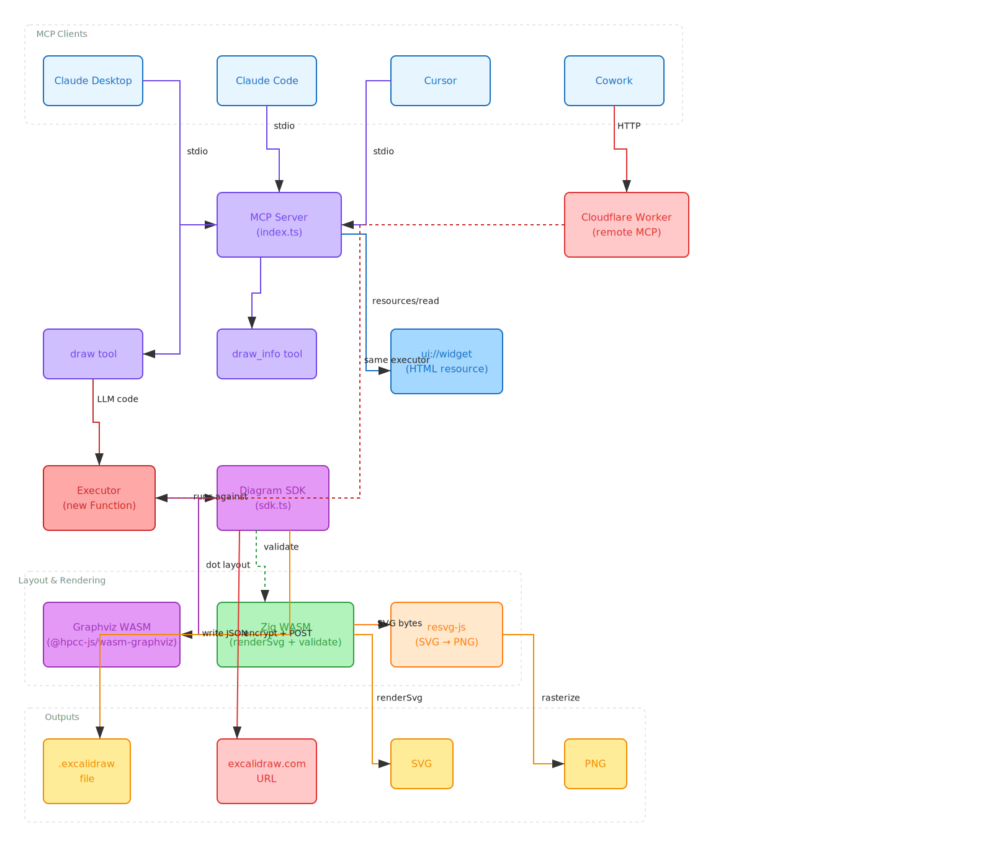

# drawmode

Code Mode MCP server for generating Excalidraw architecture diagrams. Instead of having LLMs write raw Excalidraw JSON (error-prone), they write TypeScript code against a typed SDK. Graphviz (via `@hpcc-js/wasm-graphviz`) handles graph layout with proper crossing minimization and orthogonal edge routing. A Zig WASM module handles validation.

## Features

- **Code Mode** — LLM writes TypeScript, not raw JSON. One tool, typed SDK, zero prompt engineering
- **Automatic layout** — Graphviz `dot` engine (Sugiyama algorithm) with crossing minimization and orthogonal edge routing
- **10 semantic color presets** + 18 cloud provider presets (AWS, Azure, GCP, K8s)
- **4 output formats** — `.excalidraw` file, excalidraw.com URL, PNG, SVG (multi-format in one call)
- **Interactive HTML widget** — live Excalidraw preview in Claude Desktop and Cowork via MCP structured content
- **Edit existing diagrams** — `Diagram.fromFile()` loads `.excalidraw` files for modification
- **Groups and frames** — visual containment with customizable boundaries (padding, color, style, opacity)
- **Diamonds and ellipses** — flowchart decision nodes, database cylinders
- **Zig WASM validation** — catches broken bindings, duplicate IDs, overlapping elements
- **Deploy anywhere** — local stdio, local HTTP, or Cloudflare Workers (remote MCP)

## Quick Start

```bash
# Claude Code / Cursor
npx drawmode --stdio

# HTTP mode
npx drawmode
```

### Claude Desktop / Cursor config

```json
{
  "mcpServers": {
    "drawmode": {
      "command": "npx",
      "args": ["drawmode", "--stdio"]
    }
  }
}
```

## Why Code Mode?

Traditional MCP diagram tools ask the LLM to produce raw Excalidraw JSON — hundreds of lines with pixel coordinates, bound text element pairs, arrow binding math, and edge routing. This is fragile and error-prone.

drawmode flips the approach: the LLM writes **~10 lines of TypeScript** against a typed SDK. The SDK handles all the Excalidraw complexity (labels need two elements, arrows need binding math, elbow routing needs specific flags). Graphviz handles layout. The result is always valid.

```
Traditional:  LLM → 500 lines of JSON → broken diagrams
drawmode:     LLM → 10 lines of TypeScript → SDK + Graphviz → valid diagrams
```

## How It Works

1. LLM receives one tool (`draw`) with TypeScript type definitions (~100 lines)
2. LLM writes code against the `Diagram` SDK
3. Local executor runs it — SDK handles labels, colors, IDs
4. Graphviz `dot` engine handles layout positioning and edge routing (with orthogonal splines)
5. Zig WASM handles validation
6. Output: `.excalidraw` file, excalidraw.com URL, PNG, SVG, or multiple formats at once. A `.drawmode.ts` sidecar preserves source code for iteration.

```typescript
const d = new Diagram();
const api = d.addBox("API Gateway", { row: 0, col: 1, color: "backend" });
const db = d.addBox("Postgres", { row: 1, col: 0, color: "database" });
const cache = d.addBox("Redis", { row: 1, col: 2, color: "cache" });
d.connect(api, db, "queries");
d.connect(api, cache, "reads", { style: "dashed" });
d.addGroup("Data Layer", [db, cache]);
return d.render({ format: ["excalidraw", "png"], path: "arch" });
```

## SDK API

### Creating Elements

```typescript
// Rectangles, ellipses, and diamonds
d.addBox(label, opts?)      // → element ID
d.addEllipse(label, opts?)
d.addDiamond(label, opts?)

// Standalone text and lines
d.addText(text, opts?)
d.addLine(points, opts?)

// Groups and frames
d.addGroup(label, children[], opts?)  // opts: padding, strokeColor, strokeStyle, opacity
d.addFrame(name, children[])

// Connections
d.connect(from, to, label?, opts?)
```

### Shape Options

All optional — sensible defaults are applied:

```typescript
interface ShapeOpts {
  row?: number; col?: number;           // grid positioning
  x?: number; y?: number;               // absolute positioning (bypasses grid)
  color?: ColorPreset;                  // semantic color preset
  width?: number; height?: number;
  strokeColor?: string;                 // hex override
  backgroundColor?: string;            // hex override
  fillStyle?: "solid" | "hachure" | "cross-hatch" | "zigzag";
  strokeWidth?: number;                 // default 2
  strokeStyle?: "solid" | "dashed" | "dotted";
  roughness?: number;                   // 0=architect, 1=artist, 2=cartoonist
  opacity?: number;                     // 0-100
  roundness?: { type: number } | null;
  fontSize?: number;                    // default 16
  fontFamily?: 1 | 2 | 3;              // Virgil / Helvetica / Cascadia
  textAlign?: "left" | "center" | "right";
  verticalAlign?: "top" | "middle";
  link?: string | null;                   // hyperlink URL
  customData?: Record<string, unknown> | null; // arbitrary metadata
  icon?: string;              // "database", "cloud", "lock", "server", "docker", etc. or raw emoji
}
```

### Connect Options

```typescript
interface ConnectOpts {
  style?: "solid" | "dashed" | "dotted";
  strokeColor?: string;
  strokeWidth?: number;
  roughness?: number;
  opacity?: number;
  startArrowhead?: null | "arrow" | "bar" | "dot" | "triangle" | "diamond" | "diamond_outline";
  endArrowhead?: null | "arrow" | "bar" | "dot" | "triangle" | "diamond" | "diamond_outline";  // default "arrow"
  elbowed?: boolean;          // default true
  labelFontSize?: number;
  labelPosition?: "start" | "middle" | "end";  // where to place edge label
  customData?: Record<string, unknown> | null; // arbitrary metadata
}
```

### Editing Existing Diagrams

```typescript
const d = await Diagram.fromFile("diagram.excalidraw");

// Find and inspect
const ids = d.findByLabel("API");       // substring search
const allNodes = d.getNodes();          // all node IDs
const edges = d.getEdges();            // [{ from, to, label }]

// Update
d.updateNode(ids[0], { label: "New API", color: "ai" });
d.updateEdge(from, to, { label: "writes", style: "dashed" });

// Remove
d.removeNode(d.findByLabel("Old")[0]);  // removes node + connected edges
d.removeEdge(from, to, "queries");      // remove specific edge
d.removeGroup(groupId);                 // remove group, keep children
d.removeFrame(frameId);                 // remove frame, keep children

return d.render({ path: "diagram.excalidraw" });
```

## Color Presets

### General

| Preset | Use for |
|--------|---------|
| `frontend` | UI, browser, React |
| `backend` | APIs, services, servers |
| `database` | Postgres, MySQL, DynamoDB |
| `storage` | S3, R2, blob storage |
| `ai` | ML models, embeddings |
| `external` | Third-party APIs |
| `orchestration` | K8s, Docker, schedulers |
| `queue` | Kafka, SQS, RabbitMQ |
| `cache` | Redis, Memcached |
| `users` | End users, actors |

### Cloud Providers

**AWS**: `aws-compute`, `aws-storage`, `aws-database`, `aws-network`, `aws-security`, `aws-ml`

**Azure**: `azure-compute`, `azure-data`, `azure-network`, `azure-ai`

**GCP**: `gcp-compute`, `gcp-data`, `gcp-network`, `gcp-ai`

**Kubernetes**: `k8s-pod`, `k8s-service`, `k8s-ingress`, `k8s-volume`

## Output Formats

| Format | Description | Works in |
|--------|-------------|----------|
| `excalidraw` | `.excalidraw` JSON file | Claude Code, Cursor, VS Code |
| `url` | Shareable excalidraw.com link | All clients |
| `png` | PNG image (via puppeteer) | Local with puppeteer, Cloudflare Worker |
| `svg` | SVG markup | Local with puppeteer |

Pass an array for multiple formats at once: `format: ["excalidraw", "png"]`. A `.drawmode.ts` sidecar file is always written alongside file output, preserving the source code for future iteration via `Diagram.fromFile()`.

## Architecture



### Project Structure

```
drawmode/
├── src/                     # TypeScript (MCP server + SDK)
│   ├── index.ts             # MCP server entry point (stdio + HTTP)
│   ├── sdk.ts               # Diagram SDK (addBox, connect, render, etc.)
│   ├── executor.ts          # Local executor
│   ├── layout.ts            # Layout bridge (Graphviz primary, Zig WASM fallback)
│   ├── upload.ts            # Excalidraw.com upload
│   ├── png.ts               # Image export (PNG/SVG via puppeteer)
│   ├── types.ts             # Shared types
│   └── widget.html          # MCP Apps HTML widget
├── wasm/                    # Zig WASM module
│   └── src/
│       ├── main.zig         # WASM exports
│       ├── layout.zig       # Grid layout fallback
│       ├── arrows.zig       # Arrow routing
│       ├── validate.zig     # Structural validation
│       └── util.zig         # Shared utilities
└── worker/                  # Cloudflare Worker (remote MCP)
    ├── index.ts
    └── wrangler.toml
```

### Layout Engine

**Graphviz** (via `@hpcc-js/wasm-graphviz`) is the primary layout engine — the real Graphviz C library compiled to WASM:

- **Sugiyama algorithm** — proper layered graph layout with crossing minimization
- **Orthogonal edge routing** (`splines=ortho`) — 90-degree elbows matching Excalidraw style
- **Cluster subgraphs** — groups rendered as Graphviz clusters
- **Rank constraints** — nodes with same `row` value share a rank

Falls back to Zig WASM grid → TS grid if Graphviz is unavailable.

### Zig WASM Module

- **Validation** — bound text elements, no duplicate IDs, arrow endpoints on shape edges, no overlapping elements

## Development

```bash
pnpm install              # Install dependencies
pnpm build                # Build TS + WASM
pnpm dev                  # Dev server (HTTP mode)
pnpm test                 # Run tests

cd wasm && zig build       # Build WASM module only
cd wasm && zig build test  # Run Zig tests
```

## Deployment

**Local (stdio)**: `npx drawmode --stdio`

**Local (HTTP)**: `npx drawmode` — Streamable HTTP on port 3001

**Remote (Cloudflare)**: Deploy `worker/` to Cloudflare Workers

[](https://deploy.workers.cloudflare.com/?url=https://github.com/teamchong/drawmode/tree/main/worker)

The Worker supports PNG export via [Cloudflare Browser Rendering](https://developers.cloudflare.com/browser-rendering/) — headless Chromium on the edge renders pixel-perfect PNGs using the Excalidraw renderer. Free tier includes 10 min/day. For local dev with browser rendering: `cd worker && npx wrangler dev --remote`.

## License

MIT
